# LDO Voltage Regulator Design and Layout using UMC 180nm CMOS

## Abstract

This project presents the design and implementation of a Low-Dropout (LDO) voltage regulator tailored for memory systems and high-load-current applications. The regulator is designed to provide a stable and efficient power supply with low dropout voltage while maintaining reliable operation under varying load conditions.

The design focuses on improving power efficiency and transient response, managing load variations, and minimizing noise. The LDO is designed and simulated using UMC 180nm CMOS technology in Cadence Virtuoso.

The design supports a maximum load capacitance of 4.7 µF, maximum load current of 1 A, an input supply voltage of 1.8 V, and a typical output voltage of 1.6 V.

## Specifications

| Parameter | Specification |
|---|---|
| Technology | UMC 180nm CMOS |
| Input Supply Voltage | 1.8 V |
| Output Voltage | 1.6 V |
| Maximum Load Current | 1 A |
| Maximum Load Capacitance | 4.7 µF |
| Reference Voltage | ~1.2 V |
| Temperature Range | -40°C to 125°C |

## LDO Architecture

The LDO consists of the following major blocks:

- Bandgap Reference (BGR)
- Folded Cascode Error Amplifier
- Pass Transistor
- Feedback Network

### Block-Level Schematic

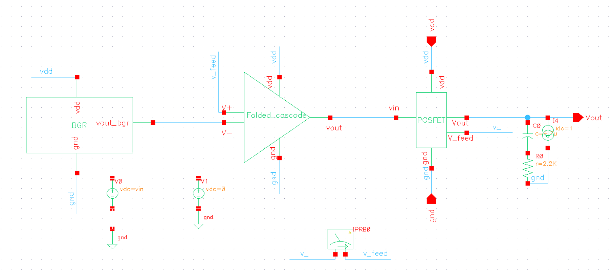

## Circuit Design

### Bandgap Reference

The bandgap reference generates a stable reference voltage for the LDO.

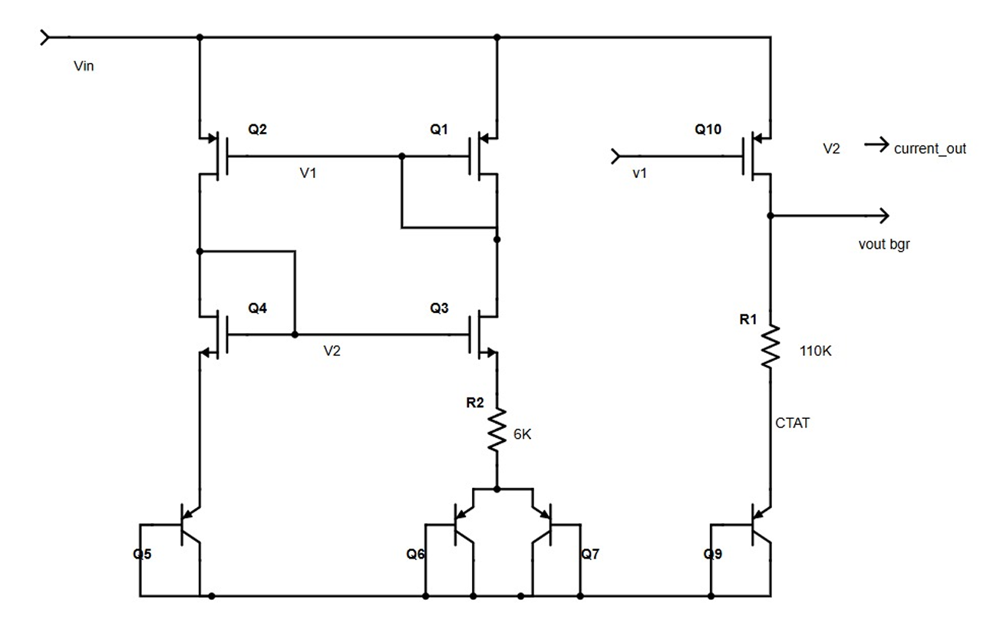

### Pass Transistor

The pass transistor controls the current delivered to the load and regulates the output voltage.

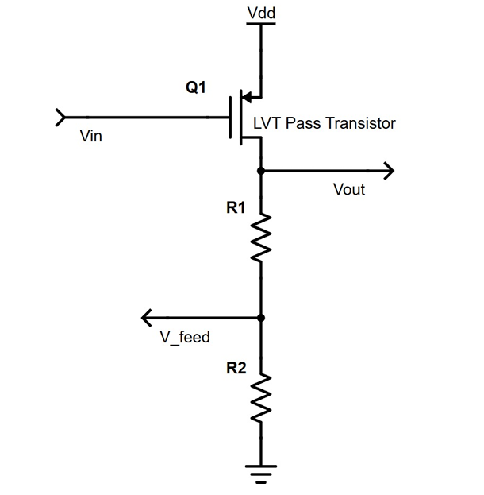

### Folded Cascode Amplifier

A folded cascode amplifier is used as the error amplifier to provide high gain and improve regulation performance.

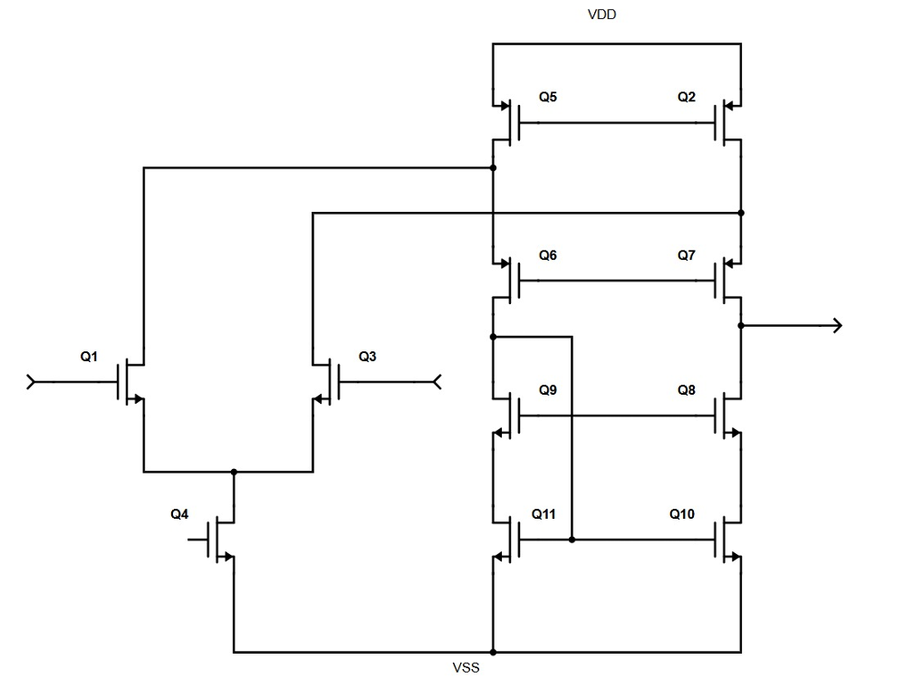

## Layout Design

### Bandgap Reference Layout

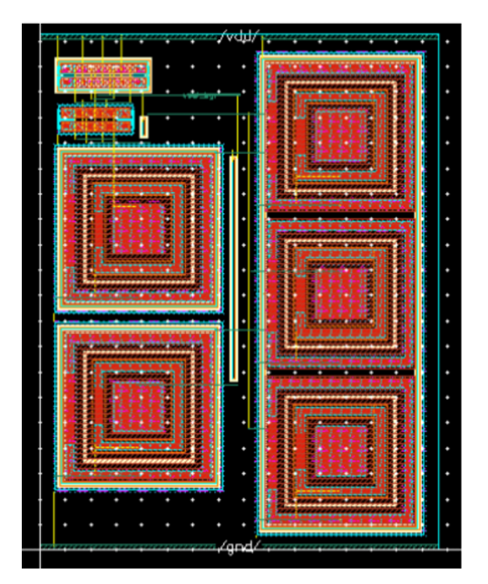

### Folded Cascode Amplifier Layout

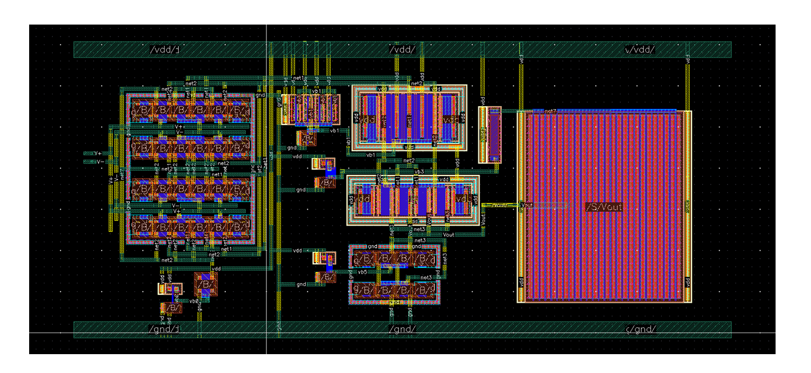

### Complete LDO Layout

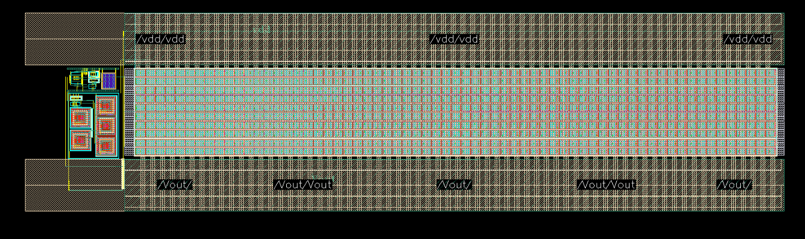

## Simulation Results

### Folded Cascode Amplifier Gain and Phase

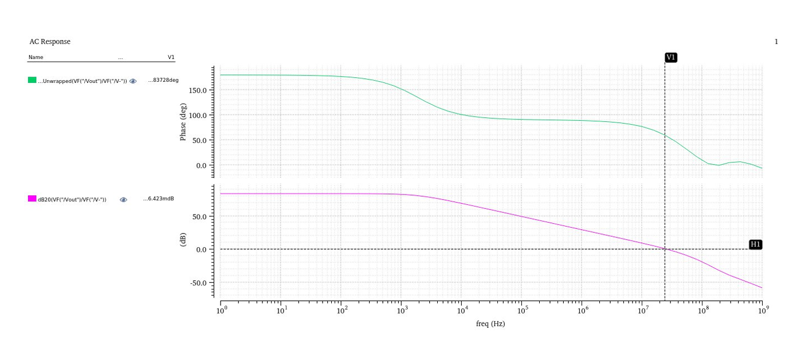

### PVT Analysis – Loop Gain

Loop gain analysis was performed across process, voltage, and temperature (PVT) conditions.

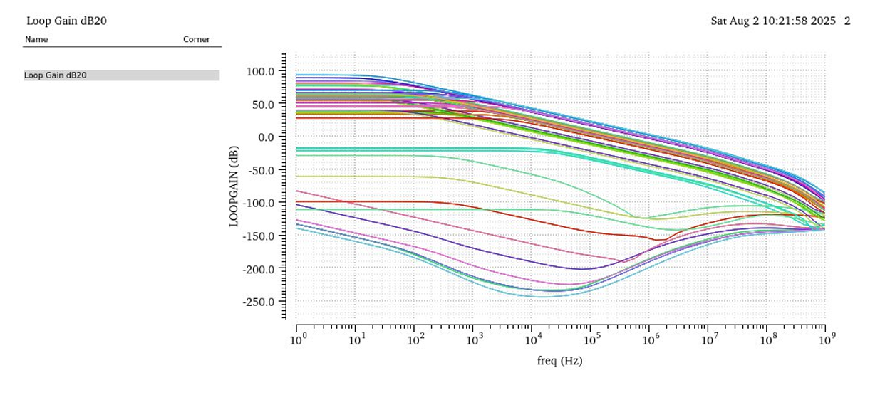

### PVT Analysis – Transient Response

Transient response was evaluated across PVT conditions to verify the stability and response of the LDO under varying operating conditions.

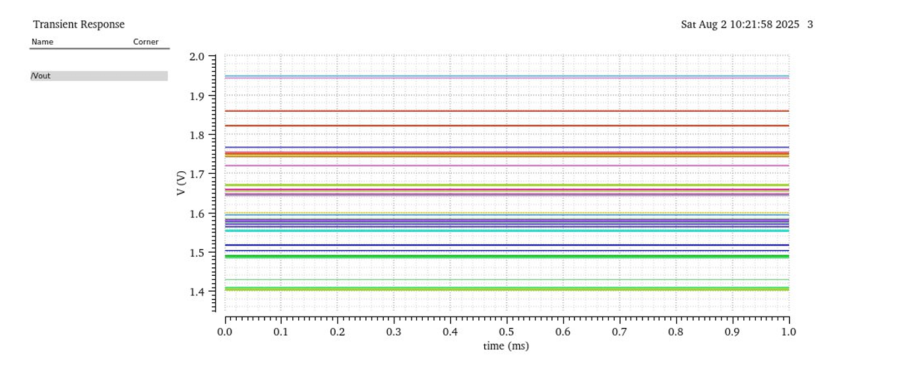

### DC Response

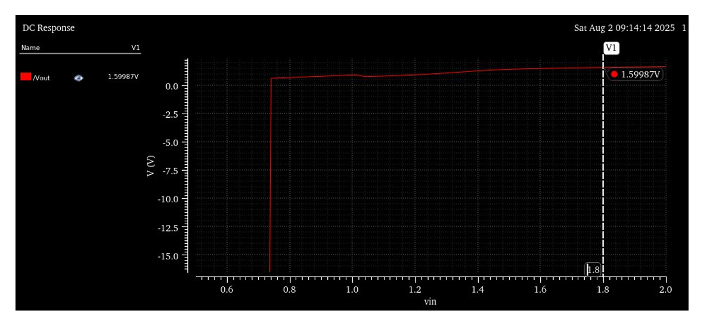

### Transient Response

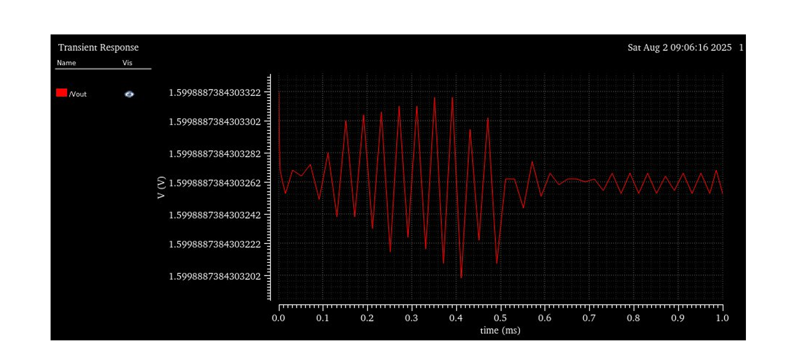

## Design Flow

1. LDO architecture definition
2. Bandgap reference design
3. Error amplifier design
4. Pass transistor design
5. Block-level integration
6. Schematic simulation
7. PVT analysis
8. Layout implementation
9. Physical verification
10. Post-layout analysis

## Tools and Technology

- Cadence Virtuoso for Schematic Design and Layout
- Cadence Spectre for Circuit Simulation
- Cadence Assura for Physical Verification
- UMC 180nm CMOS Technology

## Key Features

- 1.8 V input supply
- 1.6 V regulated output
- Maximum load current of 1 A
- Maximum load capacitance of 4.7 µF
- Bandgap reference based voltage regulation
- Folded cascode error amplifier
- PVT analysis
- Custom analog layout
- High-load-current operation
